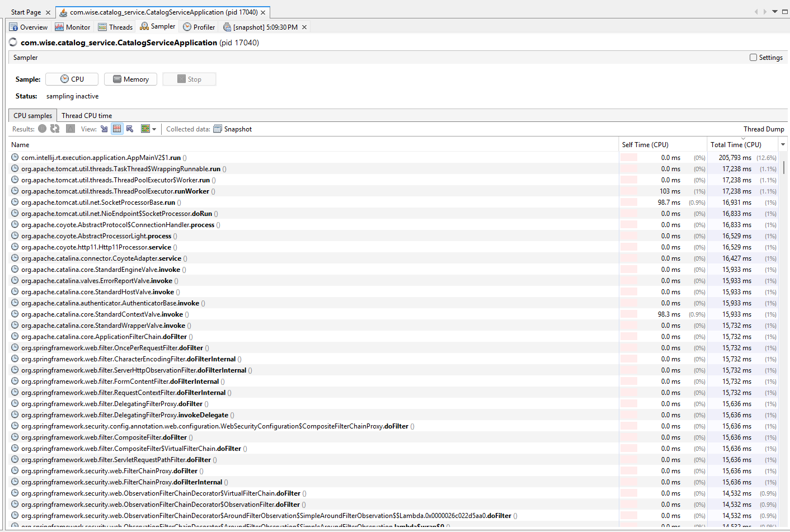
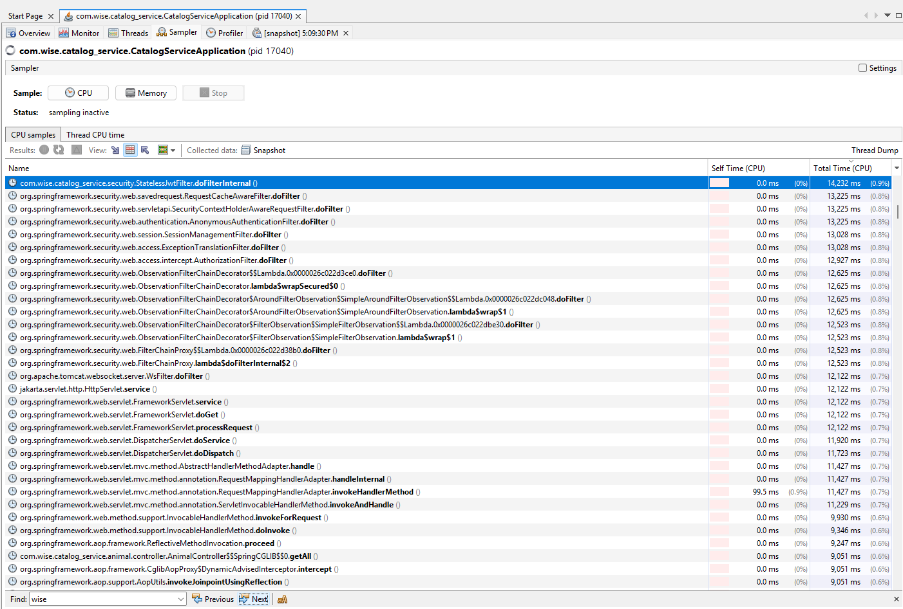
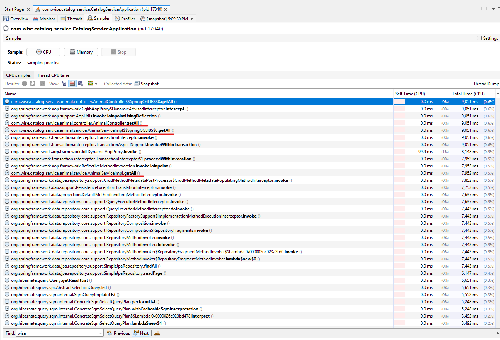
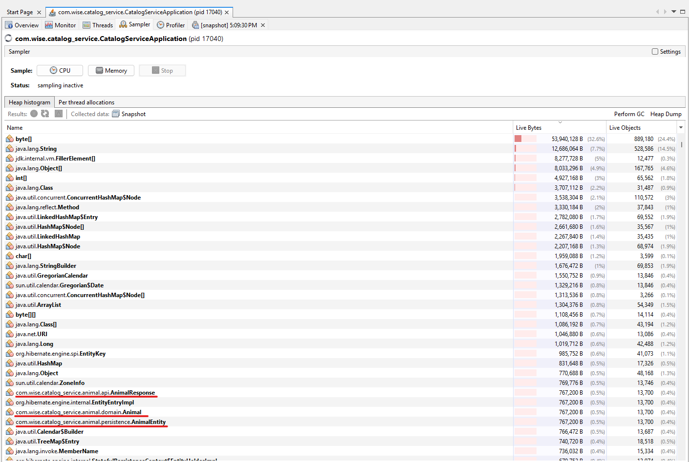
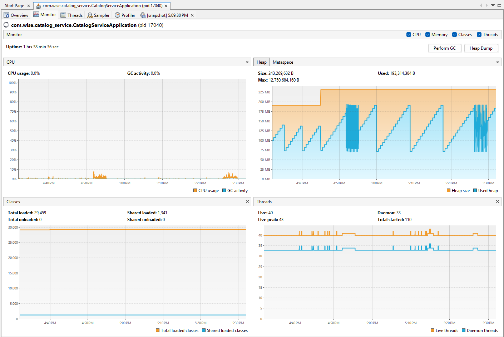

# Performance Profiling Report: catalog-service

Dynamic analysis and load testing report for the `catalog-service` microservice (`com.wise.catalog_service`) using **VisualVM** and **Postman Collection Runner**.

---

## 1. Test Setup & Methodology

* **Target Endpoint:** `GET /api/v1/animals?shelterId=1&species=DOG&page=0&size=100&sort=createdAt,desc`
* **Dataset:** 20,000 pre-generated records in PostgreSQL (`catalog.animals`).
* **Load Profile:** 2,000 HTTP requests, 0 ms delay via Postman Collection Runner.
* **Profiling Tool:** VisualVM (Sampler & Telemetry Monitor).

---

## 2. Key Findings & Observations

### ⚡ CPU Load Analysis (I/O-Bound Profile)
* **Application Behavior:** `AnimalServiceImpl.getAll()` accounts for **9,051 ms Total Time**, but its **Self Time is 0.0 ms**. The microservice code is fully optimized and executes in sub-milliseconds; execution time is spent waiting on external resources.
* **Bottlenecks:** Out of 9 seconds, **>5.6 seconds** are consumed by Hibernate SQL execution and data fetching (`getResultList`). The remainder is spent in Tomcat servlet infrastructure and the Spring Security filter chain (`StatelessJwtFilter` — **14.2 s** cumulative across all worker threads).

---

### 🧠 Heap Memory & DTO Allocation
* **Layer Transparency:** Heap dump analysis reveals exactly **13,700 instances** each for `AnimalEntity` (JPA), `Animal` (Domain), and `AnimalResponse` (DTO). This validates a clean 1:1 conversion lifecycle across architectural layers without duplicate references.
* **Memory Composition:** Primary heap consumers are `byte[]` (32.6%) and `java.lang.String` (7.7%), generated during Jackson JSON serialization.

---

### 📈 GC Stability & Health Monitoring
* **Heap Pattern:** `Used Heap` demonstrates a classic **sawtooth pattern**, peaking at ~190 MB under active load and dropping back to ~75 MB after Garbage Collection.
* **Leak Check:** GC activity remains flat (0.0%), confirming zero memory leaks and stable memory management.

---

## 3. Optimization Recommendations

1. **Database Indexing:** Add a composite index on `catalog.animals(shelter_id, species, created_at DESC)` to eliminate full table scans.
2. **Caching Layer:** Introduce Spring Cache / Redis on read-heavy endpoints to bypass database queries entirely.
3. **JPA Projections:** Replace entity fetching with interface projections for read-only DTO operations.